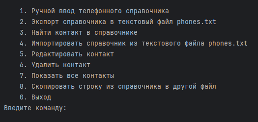
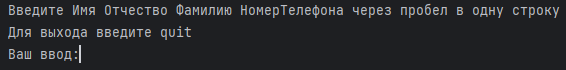
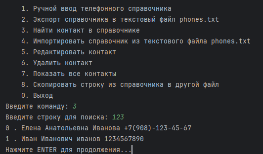
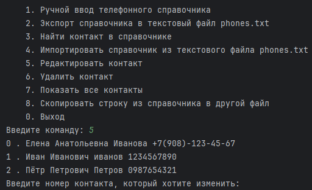
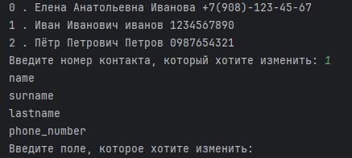
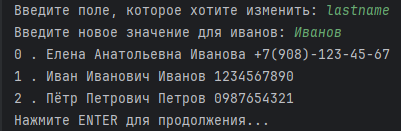
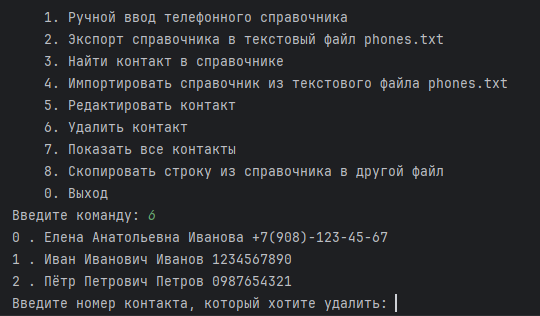
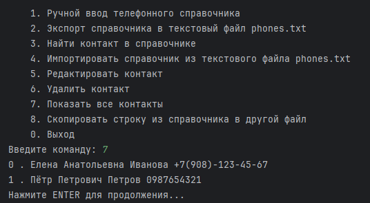
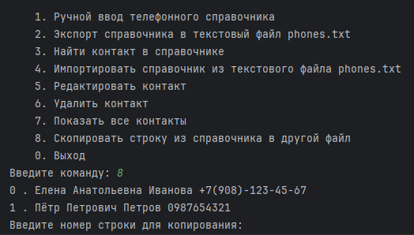
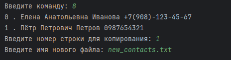

# Учебный проект по языку Python
# Телефонный справочник

## Запуск проекта
- Клонирование из репозитория
```bash
git clone https://github.com/beemaster1972/phone_book
```
- запуск
```bash
python task49.py
```
## Работа с программой

<br>

1. Ручной ввод телефонного справочника<br>

<br>
Вводим в одну строку через пробел Имя Отчество Фамилия НомерТелефона, номер телефона в произвольном формате. Для того чтобы завершить ввод данных набираем _quit_.

2. Экспорт справочника в текстовый файл phones.txt<br>  
Если файл _phones.txt_ существует в директории проекта, то введённые контакты будут дописаны в конец файла, иначе будет создан новый файл.
3. Найти контакт в справочнике<br>
<br>
Данная функция ищет в справочнике совпадение введённой строки с любой частью информации о контакте. В данном примере были выведены два контакта у которых в номере телефона есть ___123___.
4. Импортировать справочник из текстового файла phones.txt<br>
Загрузка справочника из текстового файла.<br>
- Формат файла - CSV (поля разделены запятыми, каждая запись на новой строке)
5. Редактировать контакт<br>
<br>
Выводится нумерованный список всех контактов. И надо указать номер контакта который хотим редактировать.<br>
> ВНИМАНИЕ!!! Нумерация начинается с НУЛЯ!!! <br>
> 
<br>
После указания номера контакта выводится список полей доступных для редактирования<br>
<br>
Вводим поле, в данном примере __lastname__, выводится старое значение поля. Вводим новое значение и в консоль выводится список с исправленным контактом.<br>
6. Удалить контакт<br>
<br>
вводим номер контакта который хотим удалить. <br>
> Если введём номер не существуещего контакта, например __3__, то программа выведет предупреждение __Нет такого контакта__ и вернётся в главное меню.
7. Показать все контакты<br>
<br>
Выводится список всех контактов, и программа стоит в ожидании пока не будет нажата клавиша __ENTER__.
8. Скопировать строку из справочника в другой файл<br>
<br>
Вводим номер строки для копирования<br>
<br>
И имя нового файла/<br>
> Если файл существует, то строка будет записана в конец файла, иначе будет создан новый файл и строка будет записана в начало файла.
0. Выход<br>
### ВСЕГО ХОРОШЕГО!